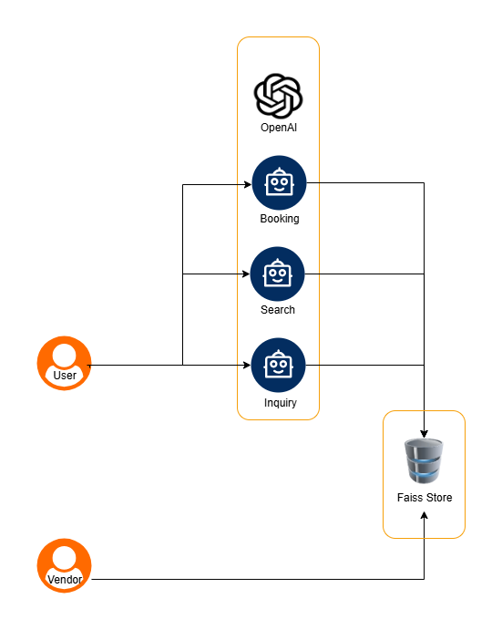

---

# 🏨 Booking App - Setup & Usage Guide

## Overview


This project is a hotel booking assistant web app built with **Streamlit** and **LangChain**.
It supports:

* Hotel vendor registration.
* Answering hotel-related questions using LLM (FAISS + Sentence Transformers).
* Booking hotels with structured booking data saved in JSON.
* Hotel search powered by semantic search (FAISS + Sentence Transformers).

---

## 📁 Project Structure

```
booking_app/
│
├── agents/
│   ├── main.py                     # Entry point.
│   ├── vendor_registration.py      # Code to register hotels
│   ├── search_agent.py             # Semantic get booked hotel details
│   ├── answer_agent.py             # Q&A about hotels
│   └── booking_agent.py            # Booking agent with LLM & JSON storage
│
├── data/
│   ├── hotels.json                 # Hotel listings data (JSON)
│   ├── bookings.json              # Saved bookings data (JSON)
│
├── vectorstore/
│   └── index.faiss                # FAISS index file for embeddings
│   └── index.faiss.meta           # FAISS metadata file for Booking and Registration
│
├── .env                          # Environment variables for keys & paths
├── app.py                        # Streamlit app UI entry point
├── requirements.txt              # Python dependencies
```

---

## ⚙️ Prerequisites

* Python 3.8+
* `pip` package manager
* OpenAI API key (or other compatible LLM API key)
* Basic familiarity with command line

---

## 🚀 Installation

1. **Clone the repository**

```bash
git clone <your-repo-url>
cd booking_app
```

2. **Create and activate a virtual environment**

```bash
python -m venv env
# Windows
.\env\Scripts\activate
# macOS/Linux
source env/bin/activate
```

3. **Install dependencies**

```bash
pip install -r requirements.txt
```

4. **Set up environment variables**

Create a `.env` file in the project root:

```ini
API_KEY=your_openai_api_key_here
MODEL=gpt-3.5-turbo
DATA_PATH=data/hotels.json
BOOKINGS_PATH=data/hotels.json
INDEX_PATH=index/hotel.index
EMBED_MODEL=all-MiniLM-L6-v2
BOOKINGS_PATH=data/bookings.json
```

Make sure the directories and files exist for the data paths.

---

## 🛠 How It Works

### Agents

* **Vendor Registration:** Adds new hotels to `hotels.json`.
* **Answer Agent:** Uses an LLM chain to answer questions about hotels.
* **Booking Agent:** Parses user booking requests with an LLM, extracts structured info, and saves bookings to `bookings.json`.
* **Search Agent:** Uses SentenceTransformer embeddings + FAISS index to find booked hotels.

### Streamlit UI Tabs

* **Vendor:** Form to register new hotels.
* **Ask a Question:** Chat-like interface to ask hotel-related questions.
* **Booking:** Booking form where users input booking details and confirm.
* **Search:** Search bar to query booked hotels semantically.

---

## 📋 Running the App

Start the Streamlit app with:

```bash
streamlit run app.py
```

Access the app locally at `http://localhost:8501`.

---

## 🛎 Usage Tips

* Register hotels first under **Vendor** tab.
* Index and embed hotel data if needed (you may need to create or update FAISS index manually or via a script).
* Use **Search** to find hotels using natural language queries.
* Use **Ask a Question** for LLM-powered Q\&A on hotel features.
* Book hotels in the **Booking** tab by entering details and submitting the form.

---

## 📂 Data Management

* `data/hotels.json` stores hotel info in JSON format.
* `data/bookings.json` stores all booking records as a JSON array.
* `vectorestore/index.faiss` stores the FAISS vector index for hotel embeddings.
* `vectorestore/index.faiss.meta` stores the FAISS meta-data store for hotel bookings and registration.

---

## 🔧 Extending & Customizing

* Add more fields to hotel registration as needed.
* Improve booking extraction prompt in `booking_agent.py`.
* Add email or SMS notification on booking confirmation.
* Connect to a database instead of JSON files for scalability.
* Add user authentication for vendor and customer management.

---

## 🆘 Troubleshooting

* **JSON decode errors:** Make sure your JSON files are valid or delete empty/corrupted files.
* **API Key errors:** Confirm your OpenAI API key is correctly set in `.env`.
* **Streamlit issues:** Ensure correct virtual environment is active and dependencies installed.
* **LLM response parsing:** Use strict prompts and/or JSON extraction regex to avoid parsing errors.

---

# 🏨 Booking App Deployment Guide

## 1️⃣ AWS SageMaker Endpoint

* Package your model in a Docker container and push to AWS ECR.
* Deploy as a SageMaker endpoint for scalable inference.
* Your app calls this endpoint for booking/registration/search tasks.

## 2️⃣ Data Storage on Amazon S3

* Store hotels, bookings, and indexes as JSON files on S3.
* Agents read/write data using AWS SDK (boto3).
* Enables decoupled, durable, and scalable storage.

## 3️⃣ Secure APIs with AWS Cognito

* Manage user sign-in/signup with Cognito User Pools.
* Protect API Gateway endpoints with Cognito authorizers.
* Add authentication flow to your frontend.

---

## Architecture Summary

* 🖥️ Frontend: Streamlit app
* ⚙️ Backend: FastAPI (Docker/Lambda)
* 🤖 Model: SageMaker endpoint
* 💾 Storage: Amazon S3
* 🔐 Security: Cognito + API Gateway

---

## 📖 References

* [Streamlit Documentation](https://docs.streamlit.io/)
* [LangChain Documentation](https://docs.langchain.com/)
* [FAISS](https://github.com/facebookresearch/faiss)
* [Sentence Transformers](https://www.sbert.net/)

---